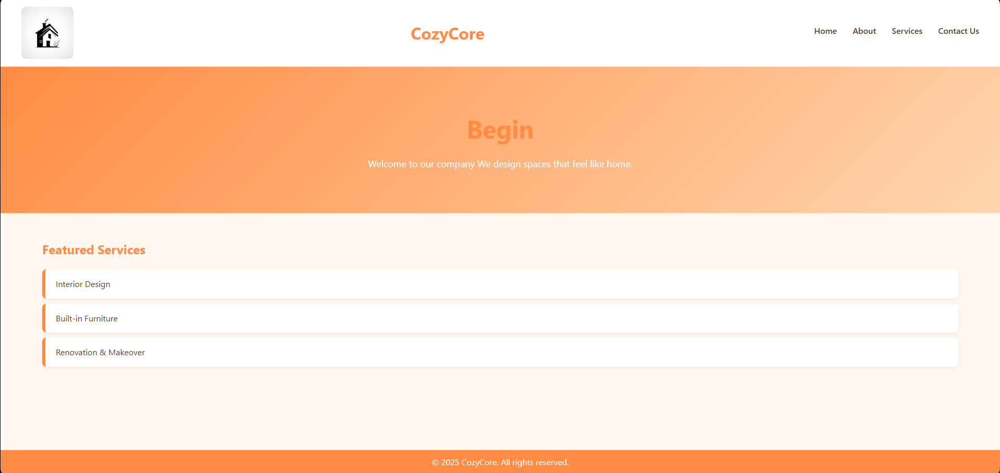
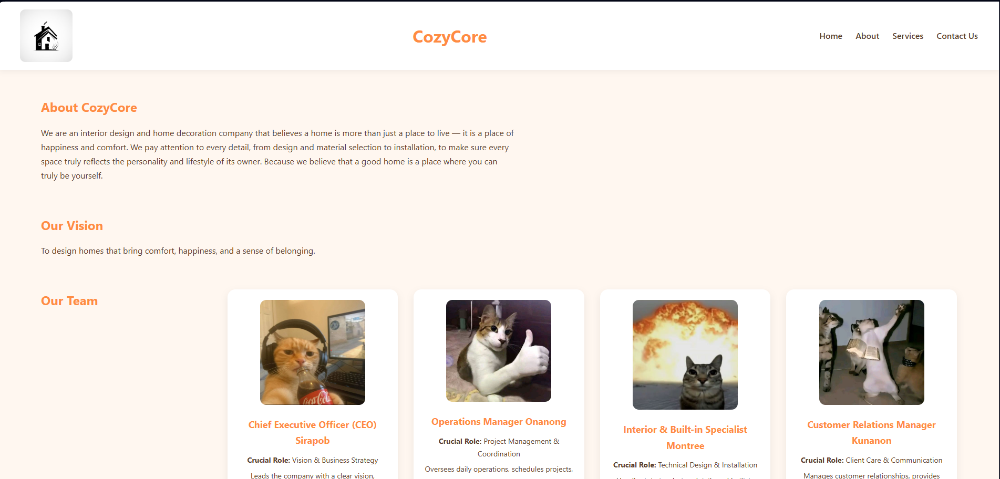
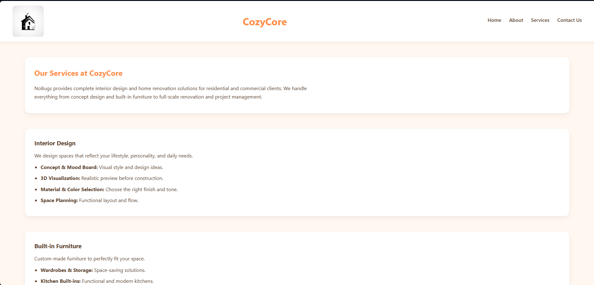
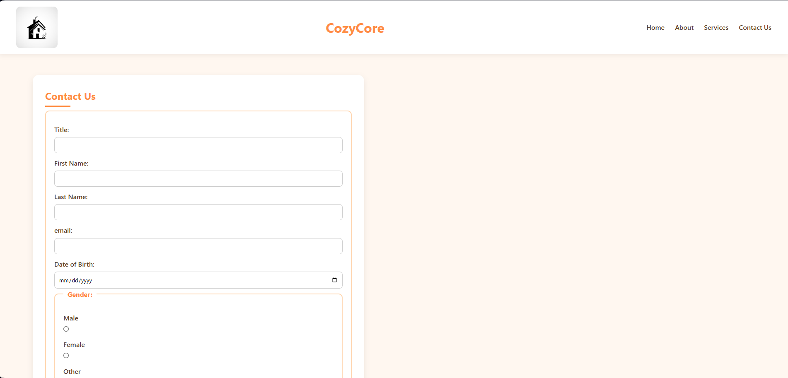
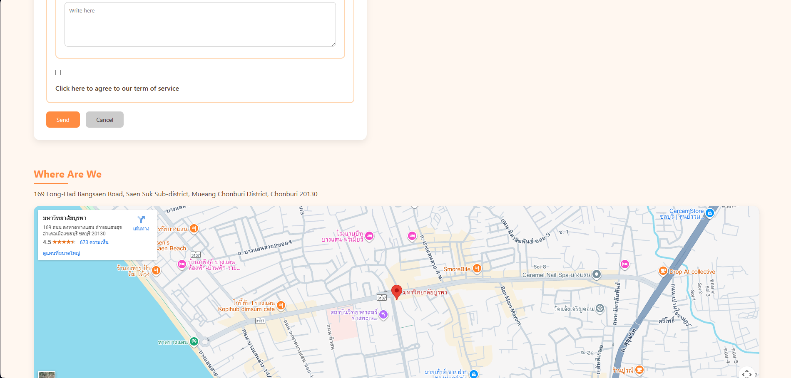

# CozyCore Business Website

## About the Project

This project is a responsive business website for **CozyCore**, an interior design and home decoration company.  
The website presents CozyCore’s vision of creating warm, functional, and well-designed living spaces for homes, condominiums, and commercial areas.

The project demonstrates the use of modern HTML5 and CSS3 techniques, with a focus on responsive design, clean layouts, and user-friendly interfaces to effectively showcase services, team information, and design solutions.

---

## Website Pages

| Page     | Description                                  | Link                               |
| -------- | -------------------------------------------- | ---------------------------------- |
| Home     | Hero section with call-to-action             | [index.html](index.html)           |
| About    | Company profile, vision, and team            | [About.html](about.html)           |
| Services | Service details and pricing comparison table | [Services.html](services.html)     |
| Contact  | Contact information and inquiry form         | [Contact_Us.html](Contact_Us.html) |

---

## File Structure

````my-business-web/
├── index.html
├── About.html
├── Services.html
├── Contact_Us.html
├── css/
│ ├── index.css
│ ├── About.css
│ ├── Services.css
│ └── Contact_Us.css
├── Pictures/
│ ├── index.png
│ ├── About.png
│ ├── about2.png
│ ├── Services.png
│ ├── services2.png
│ ├── Contact.png
│ └── contact2.png
└── README.md```

---

## CSS Implementation

### Selectors

| Type         | Examples                                 | Usage                             |
| ------------ | ---------------------------------------- | --------------------------------- |
| Universal    | `*`                                      | Reset margin, padding, box-sizing |
| Element      | `body`, `h1`, `h2`, `img`, `a`           | Base typography and layout        |
| Class        | `.container`, `.card`, `.btn`, `.navbar` | Reusable UI components            |
| ID           | `#header`, `#footer`, `#hero`            | Unique page sections              |
| Pseudo-class | `:hover`, `:active`, `:nth-child(even)`  | Interaction and table styling     |

---

### CSS Units

| Unit  | Usage                                       |
| ----- | ------------------------------------------- |
| `px`  | Borders and small spacing                   |
| `rem` | Font sizes and padding (responsive scaling) |
| `%`   | Container widths and images                 |
| `vh`  | Hero section height                         |
| `fr`  | Grid column sizing                          |

---

### Color Palette (CozyCore Theme)

| Color       | Hex Code  | Usage                   |
| ----------- | --------- | ----------------------- |
| Warm Beige  | `#f5efe6` | Background              |
| Soft Brown  | `#8b6f5a` | Headers, accents        |
| Cream White | `#ffffff` | Cards and content areas |
| Dark Gray   | `#333333` | Main text               |
| Olive Green | `#7a8f6a` | Buttons and highlights  |

---

### Typography

- **Font Family:** "Prompt", "Segoe UI", sans-serif
- **Font Weights:** 400, 600, 700
- **Line Height:** 1.6

---

### Layout & Positioning

| Technique            | Usage                      |
| -------------------- | -------------------------- |
| Flexbox              | Navigation, footer         |
| CSS Grid             | Services and team sections |
| `position: sticky`   | Navigation bar             |
| `position: relative` | Hero container             |

---

### Responsive Design

| Breakpoint         | Behavior                          |
| ------------------ | --------------------------------- |
| `max-width: 768px` | Stack layout, single-column grids |
| Mobile view        | Reduced padding and font size     |

---

## Screenshots

### Home



### About




### Services




### Contact




---

© 2025 CozyCore All rights reserved.
````
