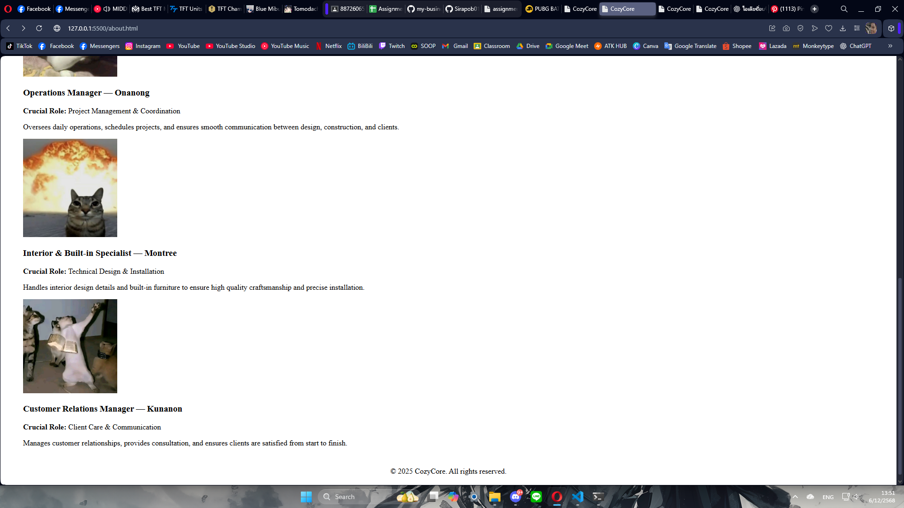
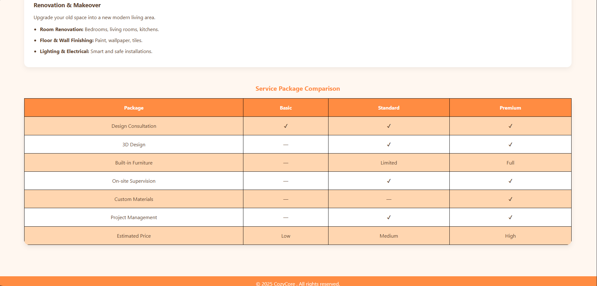

# CozyCore Business Website

## About the Project

This project is a responsive business website for **CozyCore Co., Ltd.**, an interior design and home decoration company.  
The website presents CozyCore’s vision of creating warm, functional, and well-designed living spaces for homes, condominiums, and commercial areas.

The project demonstrates the use of modern HTML5 and CSS3 techniques, with a focus on responsive design, clean layouts, and user-friendly interfaces to effectively showcase services, team information, and design solutions.

## Website Pages

| Page     | Description                                         | Link                             |
| -------- | --------------------------------------------------- | -------------------------------- |
| Home     | Hero section with animation and call-to-action      | [index.html](index.html)         |
| About    | Company history, mission/vision, and executive team | [About.html](About.html)         |
| Services | Service details and pricing comparison table        | [Services.html](Services.html)   |
| Contact  | Contact information, form, and location map         | [ContactUs.html](ContactUs.html) |

## File Structure

```
my-business-web/
├── index.html
├── About.html
├── Services.html
├── Contact Us.html
├── css/
│   └── About.css
│   └── Contact Us.css
│   └── index.css
│   └── Services.css
├── images/
│   ├── About.png
│   ├── About2.png
│   └── ...
└── README.md
```

## CSS Implementation

### Selectors

| Type         | Examples                                  | Usage                                 |
| ------------ | ----------------------------------------- | ------------------------------------- |
| Universal    | `*`                                       | Reset margin, padding, box-sizing     |
| Element      | `body`, `h1`, `h2`, `img`, `a`            | Base typography and responsiveness    |
| Class        | `.container`, `.card`, `.btn`, `.nav-bar` | Reusable components and layout        |
| ID           | `#Header`, `#footer`, `#mission-vision`   | Unique page sections                  |
| Pseudo-class | `:hover`, `:active`, `:nth-child(even)`   | Interactive states and table striping |

### CSS Units

| Unit  | Usage                                              |
| ----- | -------------------------------------------------- |
| `px`  | Borders, box-shadows, fixed spacing                |
| `rem` | Font sizes, margins, paddings (Responsive scaling) |
| `%`   | Container widths, fluid images                     |
| `vh`  | Hero section height (100vh)                        |
| `fr`  | Grid fractions for flexible column layouts         |

### Color Palette

| Color      | Hex Code  | Usage                                    |
| ---------- | --------- | ---------------------------------------- |
| FB Blue    | `#1877f2` | Headers, Primary Buttons, Links, Accents |
| Green      | `#42b72a` | Secondary Buttons (Chat/Sign up)         |
| Dark Gray  | `#1c1e21` | Primary Text                             |
| Light Gray | `#f0f2f5` | Page Background                          |
| White      | `#ffffff` | Cards, Navbar, Content Areas             |

### Typography

- **Font Family:** "Prompt", "Roboto", "Segoe UI", sans-serif
- **Font Weights:** 400 (regular), 600 (semi-bold), 700 (bold)
- **Line Height:** 1.6 (readability)
- **Text Effects:** `text-align: justify`, `text-shadow` (Hero section)

### Box Model

- **Padding:** Used for inner spacing in cards, buttons, and sections
- **Margin:** Spacing between sections and elements
- **Border:** Input fields, table cells, team images
- **Border-radius:** Rounded corners (8px, 15px, 50% for avatars)

### Positioning & Layout

| Property             | Usage                              |
| -------------------- | ---------------------------------- |
| `position: sticky`   | Navigation bar stays at top        |
| `position: fixed`    | Back-to-top button and Chat widget |
| `position: absolute` | Centering text over Hero image     |
| `position: relative` | Parent container for Hero section  |

### Display & Layout Systems

| System                  | Usage                                               |
| ----------------------- | --------------------------------------------------- |
| `display: flex`         | Navigation menu, contact form layout, footer        |
| `display: grid`         | Services grid (2-column), Team grid, Mission/Vision |
| `grid-template-columns` | `repeat(auto-fit, minmax(...))` for responsiveness  |
| `justify-content`       | Centering navigation items                          |
| `gap`                   | Spacing between grid/flex items                     |

### Hover & Interaction Effects

| Effect           | CSS Properties                                            |
| ---------------- | --------------------------------------------------------- |
| Button hover     | Color change, `transform: translateY(-2px)`, shadow       |
| Card/Image hover | `transform: translateY(-5px)`, `scale(1.1)` (zoom effect) |
| Link active      | `border-bottom` highlight for current page                |
| Animations       | Keyframes `@slideInUp` for Hero text load                 |
| Smooth Scroll    | `scroll-behavior: smooth` for "Top" button                |

### Responsive Design

| Breakpoint         | Changes                                               |
| ------------------ | ----------------------------------------------------- |
| `Max-width: 768px` | Stack navigation, single column grids, adjust padding |
| Mobile View        | Hide chat widget, adjust font sizes, vertical layouts |

---

## Screenshots

_(Place your screenshots in the 'images' folder and update paths below)_
[Home](index.html)


[About](About.html)



[Services](Services.html)



[ContactUs](Contact Us.html)


---

© 2025 Meta Platforms, Inc. (Mockup Project). All rights reserved.
